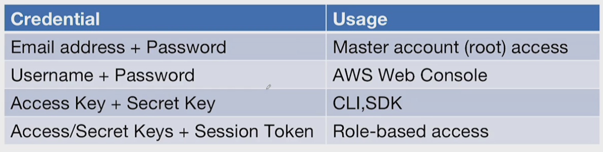

#  AWS E INTRODUCCIÓN A SERVICIOS CLOUD
    1.Creacion de cuenta aws
        -IAM ,users and groups
        
        

    2.Conociendo la consola AWS y servicios
        -EC2 <> LIGHTSAIL
        -S3
        -GLUE
        -ATHENA
        -REDSHIFT
        -LAMBDA
        -STEP FUNCTION
    3.Sdk's
        aws cli
        https://docs.aws.amazon.com/cli/latest/userguide/getting-started-install.html
    4.Python
        Refresh Python

# aws cli & sdk

    
    instalar python => ejecutar  " pip install boto3  "
    
    

